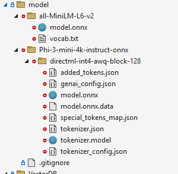

To build and run the project, you will also need to make sure to download the models and vocab files from HuggingFace.

We are currently using three models:

* [Phi3](https://huggingface.co/microsoft/Phi-3-mini-4k-instruct-onnx)
* [optimum/all-MiniLM-L6-v2](https://huggingface.co/optimum/all-MiniLM-L6-v2)
* [nomic-ai/nomic-embed-text-v1](https://huggingface.co/nomic-ai/nomic-embed-text-v1/tree/main) - we use the `model_quantized.onnx` - renamed to `model.onnx`

Place the models in the model directory as ilustrated by this screenshot

